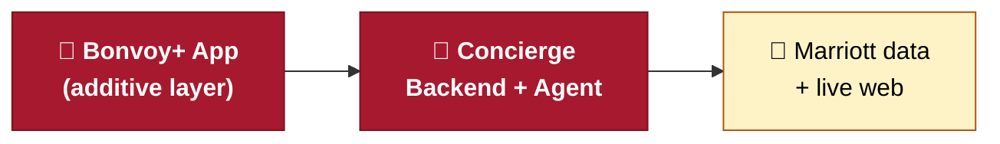
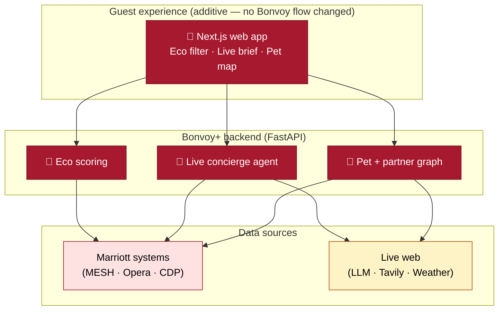
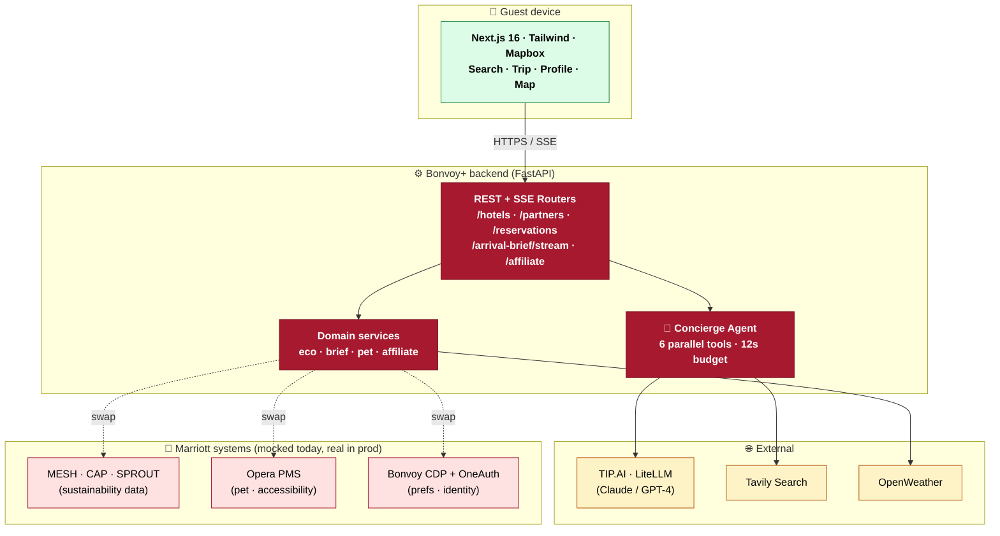
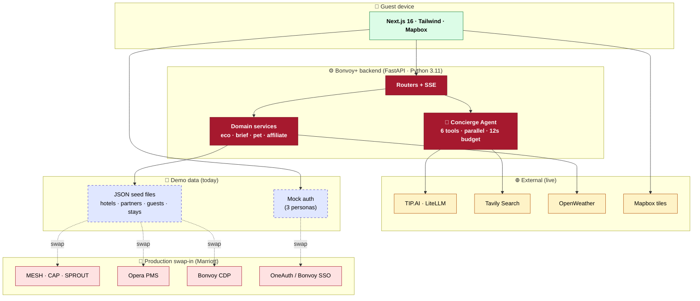
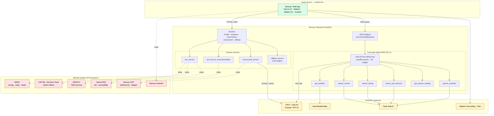

# Bonvoy+ — Architecture Diagram Variants

> Same architecture, **5 levels of detail.** Pick the one that matches your
> audience and how long you have to explain it. For Slide 7, our
> recommendation is: **build from V1 → V2 → V3** as an animated sequence
> (3 clicks), then keep V4 and V5 in the appendix for Q&A.
>
> All diagrams are Mermaid — paste into <https://mermaid.live> → export
> SVG/PNG, or render natively in GitHub/Notion previews.

---

## Audience cheat sheet

| Version | Boxes | Best for | Time to explain |
|---|---|---|---|
| **V1 — Elevator** | 3 | "What did you build?" elevator answer | 15 sec |
| **V2 — Three layers** | 5 | Executive leadership, opening of Slide 7 | 30 sec |
| **V3 — Hero** ⭐ | 9 | **Slide 7 main diagram** (judges + ELT) | 60 sec |
| **V4 — With prod swap** | 12 | "How does this become real?" follow-up | 90 sec |
| **V5 — Full technical** | 20+ | Engineering Q&A / appendix only | 2–3 min |

---

## V1 — Elevator (3 boxes)

> **Use when:** someone stops you in the hallway. One sentence per box.

**One-liner:** *"Mobile app on the left, our backend in the middle,
Marriott's existing data plus live web search on the right. We don't
replace anything — we surface what's already there."*

---

## V2 — Three layers (5 boxes)

> **Use when:** opening Slide 7 for executives. Names the three
> behaviors that move KPIs.

**Talking script (~30 sec):**
*"Three features, one app. Eco scoring reads from Marriott systems we
already have. The concierge agent pulls live web data through a privacy
boundary. The pet + partner graph blends both. Everything is additive —
nothing in the existing Bonvoy flow changes."*

---

## V3 — Hero diagram ⭐ (9 boxes — recommended for Slide 7)

> **Use when:** this is the actual Slide 7. Names every component but
> still fits on a single slide without a magnifying glass.

**Legend (small text, bottom of slide):**
- 🟢 **Green** = guest device
- 🔴 **Red (filled)** = what we built
- 🔴 **Red (outline)** = Marriott systems we'd swap in for prod
- 🟡 **Yellow** = third-party APIs (privacy-bounded)
- ⤳ **Dashed arrow** = "swap to prod" — same interface, real data

**Talking script (~60 sec):**
*"Phone on top, our FastAPI backend in the middle, with three things
plugging into it: third-party APIs for live data, and Marriott's existing
systems on the right — which today are mocked, but the swap path is just
the dashed arrow. The agent box is the one judges should care about: six
tools running in parallel with a twelve-second budget, streaming back to
the phone over SSE. That's why the demo shows a live trace pane — it's a
real agent, not a single LLM call."*

---

## V4 — With production swap arrows (12 boxes)

> **Use when:** an exec asks **"how does this go live?"** Same shape as
> V3 but every external/Marriott node is paired with the prod system it
> swaps into. Good as the second click of an animated build.

**Talking script (~90 sec):**
*"Same picture, with the production path made explicit. The blue dashed
boxes at the bottom are what we use for the demo today — JSON seeds and a
three-persona mock login. Every dashed arrow points to the real Marriott
system that replaces it: MESH for sustainability, Opera PMS for pet
policy, Bonvoy CDP for preferences, OneAuth for identity. The interfaces
are already shaped to match production — the swap is a config change, not
a rewrite."*

---

## V5 — Full technical (engineering Q&A only)

> **Use when:** an engineer in the audience asks for the gory details.
> This is V3 of the original Appendix E, kept here for completeness.
> **Do not put on the main slide** — it's an appendix-only artifact.

---

## Recommended build for Slide 7 (animated)

If your deck supports staged appearance (PowerPoint "Appear" / Keynote
"Build In"), animate the diagram in three clicks:

| Click | Show | Say |
|---|---|---|
| **1** | V2 (3 layers) | *"Three things plug into our backend: the app, Marriott data, and live web."* |
| **2** | V3 (hero, ⭐) | *"Inside our backend, an agent runs six tools in parallel — that's the live trace you'll see in the demo."* |
| **3** | V4 (prod swap) | *"And every demo data source has a clean swap path to the real Marriott system."* |

This converts a single dense diagram into a 90-second story with three
distinct beats — far easier to absorb than one packed image.

---

## Color palette (for visual consistency)

If you redraw these in Lucidchart / Figma instead of Mermaid, use:

| Role | Fill | Stroke |
|---|---|---|
| Guest / phone | `#dcfce7` | `#15803d` |
| What we built (Bonvoy+) | `#A6192E` (Marriott red) | `#7a1222`, white text |
| Marriott systems | `#fee2e2` | `#A6192E` |
| Third-party / external | `#fef3c7` | `#b45309` |
| Demo-only / mocked | `#e0e7ff` | `#4338ca`, dashed |

---

## How to render

1. **Fastest:** open <https://mermaid.live> → paste any block → export SVG → drop into the slide.
2. **Native preview:** these blocks render automatically in GitHub / GitLab / Notion / Cursor previews of this file.
3. **PowerPoint / Keynote:** use the exported SVG (M365 + Keynote both support SVG natively — resize without quality loss).

---

## TL;DR — which one to put on Slide 7?

> **Use V3.** It's the sweet spot — every important concept is named,
> nothing is missing, and it still reads in under a minute. Keep V4 and
> V5 in the appendix; pull them up only if the judges/exec asks how it
> goes to production or how the agent works internally.
