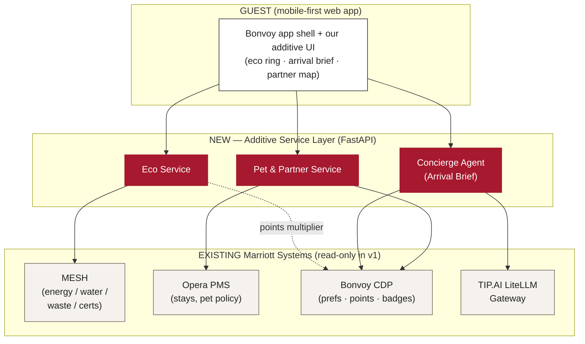
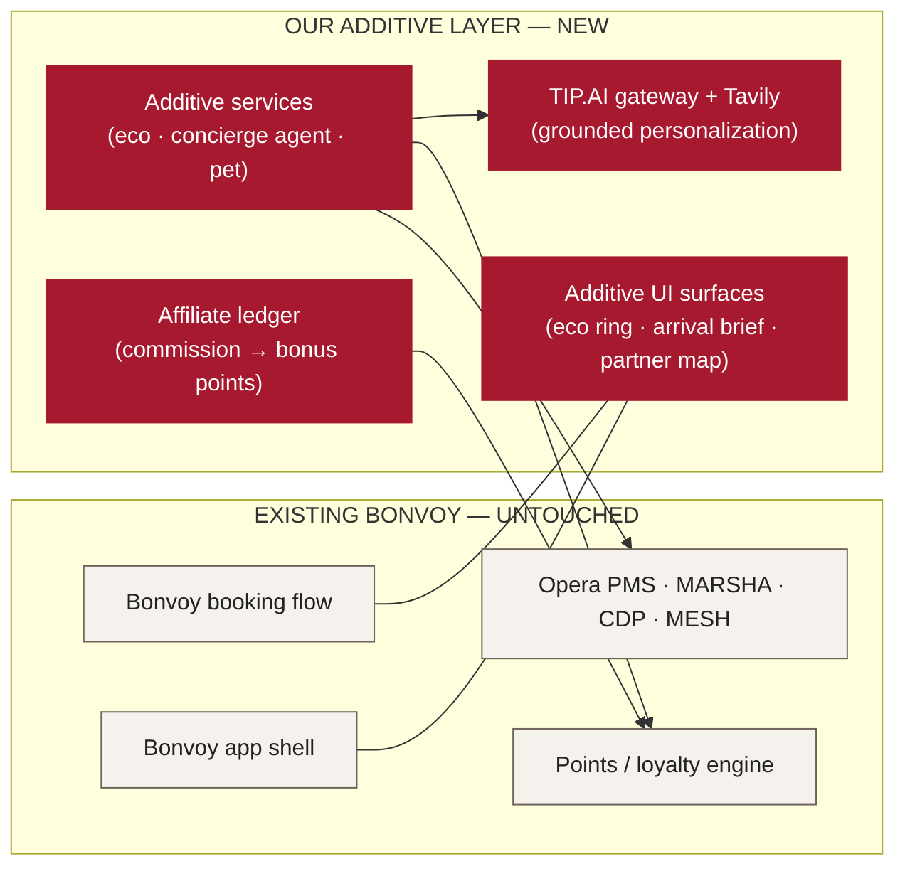
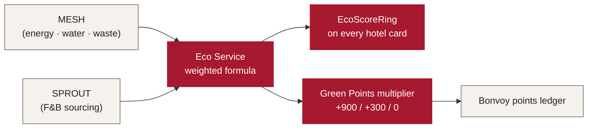
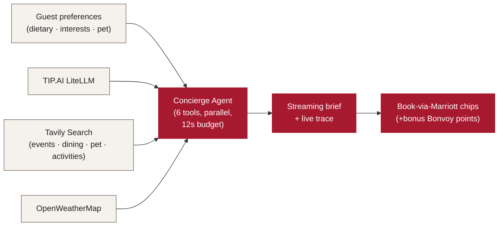
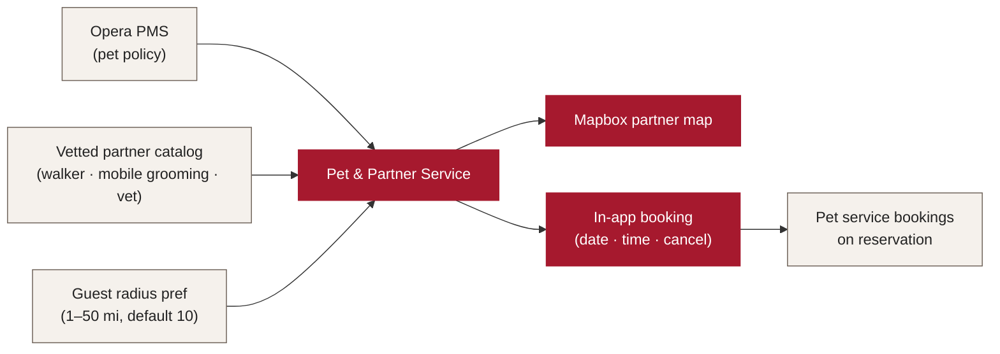
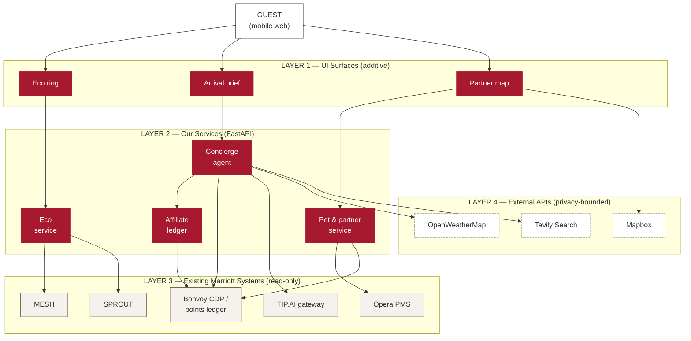
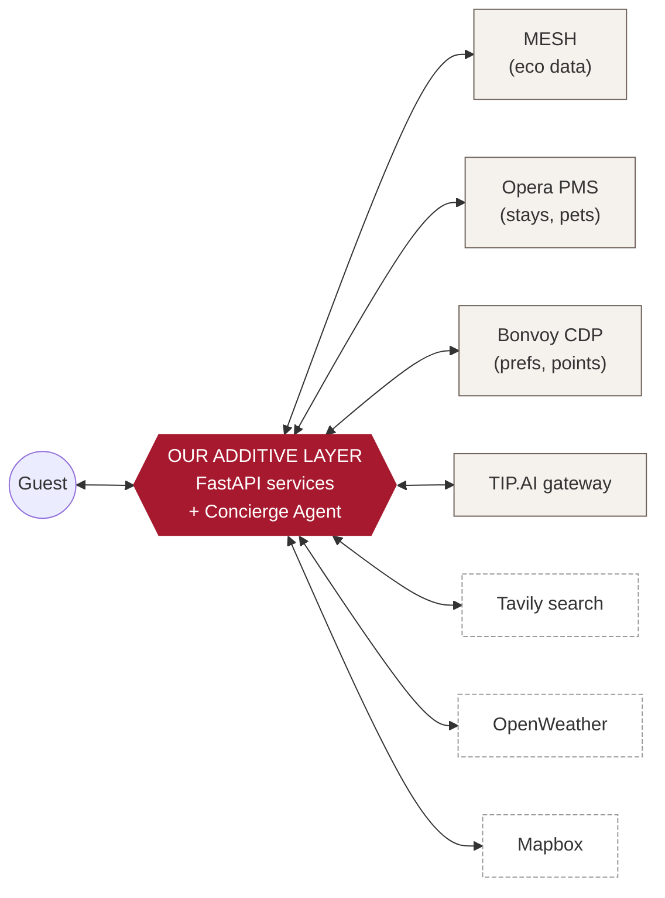

# Architecture Diagram — Alternative Versions (Slide 7)
### Same content. Different ways to land it with execs.

> Pick **one** to put on slide 7. If a single diagram still feels heavy, use **V2** as
> the main slide and tuck **V1** or **V6** into the appendix for Q&A.
>
> All diagrams render at [mermaid.live](https://mermaid.live) — paste, screenshot, drop into PPT.
>
> **Reading guide:**
> - V1 = simplest (3 lanes, 9 boxes) — fastest to grok
> - V2 = "untouched vs additive" — strongest exec narrative
> - V3 = three small diagrams, one per hero feature — visual variety
> - V4 = onion layers — for the design-y crowd
> - V5 = numbered story flow — best if you want to walk the diagram beat-by-beat
> - V6 = hub-and-spoke — emphasizes our additive layer as the center of gravity

---

## V1 — Three Clean Lanes (recommended for the slide)

**Vibe:** "Three layers, one direction of data flow. Read top-to-bottom."
**Box count:** 9. **Use when:** the room hasn't seen the project before.

**One-line takeaway:** *Red is what we built. Cream is what already exists. The arrow direction tells the whole story.*

---

## V2 — "Untouched vs Additive" (strongest exec narrative)

**Vibe:** "We don't change a thing. We extend."
**Box count:** 10. **Use when:** judges/execs are sensitive to "are you proposing to rewrite Bonvoy?" — this slide answers it before they ask.

**One-line takeaway:** *The left lane is Bonvoy as it is today. The right lane is everything we add. They meet at the UI shell and the points ledger — nothing else.*

---

## V3 — Feature-Centric Trio (small diagrams, one per hero)

**Vibe:** "Three independent bets. Each is a clean two-step story."
**Use when:** you want the eye to land on **one feature at a time** rather than the whole system.

> Lay these out side-by-side as three small images on slide 7 (or break onto 3 slides if you have room).

### V3a — Eco Rating

### V3b — Arrival Brief (agentic concierge)

### V3c — Pet + Local Partner Map

**One-line takeaway:** *Each feature is small enough to defend on its own. Together they form one additive layer.*

---

## V4 — Onion Layers (design-forward)

**Vibe:** "The guest is at the top. Each layer below is one degree further from them."
**Use when:** the room responds to structure-as-storytelling.

**One-line takeaway:** *Four layers. We touch the top two. We read the next layer. The outermost layer is opt-in.*

---

## V5 — Numbered Story Flow (walk it like a script)

**Vibe:** "I'll walk you through what happens when a Bonvoy member uses this."
**Use when:** you'd rather narrate than explain — best for a live walkthrough.

```mermaid
flowchart LR
    G["1 · Guest opens<br/>hotel detail"] --> ECO["2 · We pull eco<br/>data from MESH"]
    ECO --> RING["3 · Eco ring + Green Points<br/>multiplier render inline"]
    RING --> BOOK["4 · Guest books<br/>(existing Bonvoy flow)"]
    BOOK --> BRIEF["5 · 48h pre-stay:<br/>guest opts in to brief"]
    BRIEF --> AGENT["6 · Concierge agent runs<br/>6 tools in parallel"]
    AGENT --> RESULT["7 · Brief streams to UI<br/>with live trace"]
    RESULT --> CTA["8 · Tracked affiliate chip<br/>→ bonus Bonvoy points"]
    CTA --> MAP["9 · In-stay: pet + partner map<br/>(radius-filtered)"]
    MAP --> PET["10 · Book pet service in-app<br/>zero front-desk involvement"]

    classDef step fill:#A6192E,stroke:#A6192E,color:#fff
    class G,ECO,RING,BOOK,BRIEF,AGENT,RESULT,CTA,MAP,PET step
```

**One-line takeaway:** *Ten steps. Steps 1–4 happen on day 0. 5–8 happen 48 hours before check-in. 9–10 happen on property. No associate is involved in any step.*

---

## V6 — Hub-and-Spoke (our layer at the center of gravity)

**Vibe:** "We sit between the guest and Marriott's systems-of-record. Everything routes through our additive layer."
**Use when:** you want to emphasize that the additive layer is the **integration surface** — minimal coupling to any single system.

**One-line takeaway:** *One integration surface. Read from many, write to one (points ledger).*

---

# Which one should you use?

| Audience profile | Pick |
|---|---|
| Execs who haven't seen the project before | **V1** (3 lanes) |
| Execs worried about disruption to existing Bonvoy | **V2** (untouched vs additive) |
| You want to spend more slide time per feature | **V3** (trio) |
| Design-savvy panel, time to read | **V4** (onion) |
| You'd rather narrate than explain | **V5** (numbered) |
| Architecture panel asking "how does this integrate?" | **V6** (hub-and-spoke) |

**My recommendation for an exec audience:** lead with **V2** on the slide; keep **V1** in the appendix; have **V5** ready as a fallback if a judge asks "walk me through it end-to-end."

---

# Style notes (so the diagrams stay on-brand)

- **Red `#A6192E` = something we built.** Cream `#F5F1EC` = existing Marriott. Dashed-outline white = external API.
- **One arrow direction.** Avoid bidirectional arrows except in V6 where the hub pattern depends on it.
- **Max ~10 boxes per diagram.** If you need more, split into V3-style smaller diagrams.
- **Box labels are nouns, not verbs.** ("Eco Service" not "Compute eco score").
- **Render PNG at 2x for projector clarity.** mermaid.live → Actions → Download PNG → "2x".
