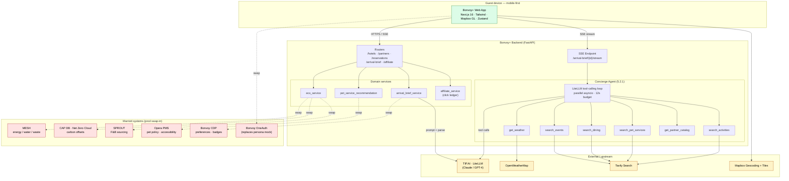
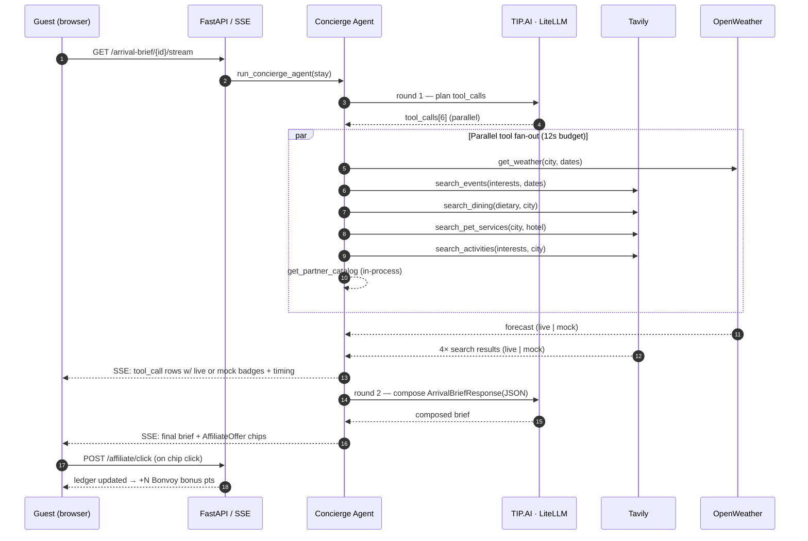
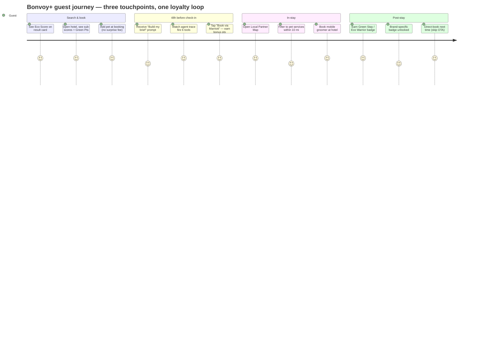
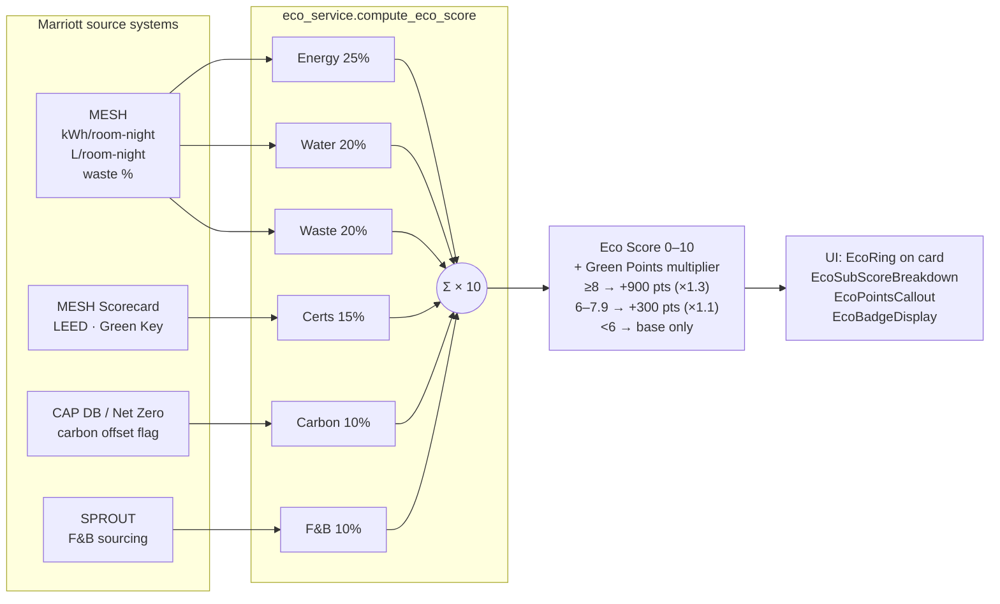
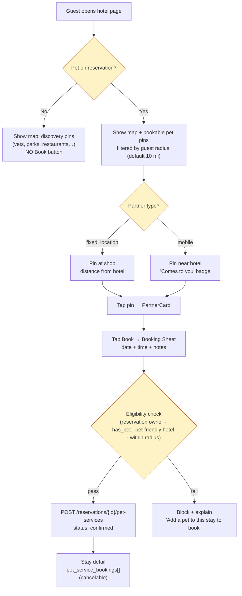
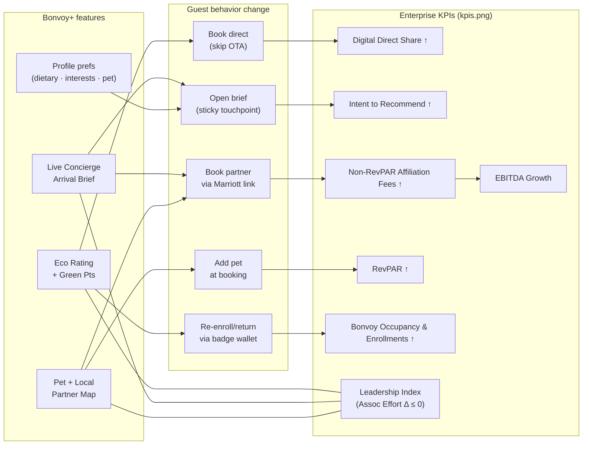
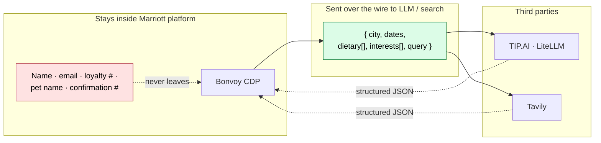
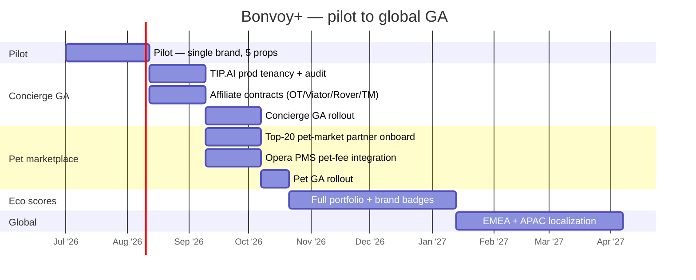

# CodeFest 4.0 — The Duo
## Slide-by-slide content to paste into the deck

> Source template: `docs/Codefest 4.0 - The Duo - orough.pdf` (14 slides).
> Project root: `marriott-personalized-stays/` — see `APP_PRD.MD` for full spec.
> Use this file as the single source of truth when filling in the slide deck.

---

## Slide 4 — Project Title

**Title:** **Bonvoy+ : Personalized Stays for Every Generation**

**Subtitle:** An additive Bonvoy layer that surfaces per-property eco scores,
an agentic pre-arrival concierge, and a pet + local partner marketplace —
without adding a single minute of associate effort.

**Tagline (one-liner under title):**
> *"Marriott already has the data and the partners. We just made them
> visible, personal, and bookable — for everyone, not just one generation."*

**Team:** The Duo · Dhruv Varshney & Katakota Satyajit Patra · 05/19/2026

---

## Slide 5 — Meet The Duo

| | |
|---|---|
| **Dhruv Varshney** | **Katakota Satyajit Patra** |
| *(photo)* | *(photo)* |
| Full-stack + agentic AI | Frontend, UX, demo polish |
| Owns: backend FastAPI services, LiteLLM concierge agent, Tavily integration, eco scoring engine, affiliate ledger | Owns: Next.js 14 app, Mapbox partner map, arrival brief UI, agent trace pane, profile + preferences |

**Tag line under photos:** *Two engineers. Three hero features. Zero new associate workload.*

---

## Slide 6 — Hypothesis

### What are we addressing?
**A Problem that exists today + a New Opportunity** (functional + technological).

Bonvoy enrollment is climbing across **every generation**, yet three guest
needs sit unmet across the booking → in-stay journey:

1. **Sustainability transparency** — guests cannot see *which* Marriott
   property is greener at booking time, even though Marriott already
   measures it via MESH and Serve360.
2. **Personalized pre-arrival context** — there is no automated, tailored
   brief between booking and check-in; the concierge phone line is the
   only fallback.
3. **Pet + local discovery** — "pet friendly: yes" is a checkbox, not an
   experience. Local partners (vets, walkers, mobile groomers, dog parks)
   live outside Marriott's surface area.

### Why now (data)
- **Gen Z = 12 % of Bonvoy enrollment in 2024 (up from 1 % in 2017) but only
  1.6 % of revenue** — they enroll and vanish (PRD §1).
- **83 %** of modern travelers prioritize personalized experiences over points.
- **60 %** of travelers expect AI-driven personalized recommendations.
- **65 %** of US travelers find booking travel overwhelming.
- **Airbnb captures 38 %** of younger travelers vs **Marriott's 23 %**.
- US **pet travel market ≈ $10 B+**; **70 %** of pet owners say pet-
  friendliness influences hotel choice.
- Marriott's own **Serve360 2025 → 2030 goals** demand visible, per-property
  sustainability progress — but no guest-facing surface exposes it.

### Hypothesis (testable)
> *"If we surface per-property eco data, ship a streaming agentic arrival
> brief, and turn pet-friendliness into a bookable marketplace — all
> additive to existing Bonvoy flows — we will lift Digital Direct Share,
> Intent to Recommend, and Bonvoy Enrollment-to-Revenue conversion,
> while holding Associate Effort Delta ≤ 0."*

### Business value delivered
| Lever | Mechanism | Conservative target |
|---|---|---|
| **Additional revenue** | Affiliate commissions (OpenTable 8 %, Viator 8 %, Rover 15 %, Ticketmaster 5 %) on every concierge recommendation, captured via tracked deeplinks (`utm_source=marriott_bonvoy`) | **~$3–6 incremental margin per agentic stay** at modeled rates |
| **Direct-channel lift** | Eco score + Green Points multiplier visible only in Marriott's app/web — strong reason to skip OTAs | **+1–2 pts Digital Direct Share** in pilot markets |
| **Retention / NPS** | Personalized arrival brief addresses the 65 % "booking is overwhelming" stat and creates a sticky touchpoint between booking and arrival | **+ Intent to Recommend** for guests who view a brief |
| **Operational efficiency** | Self-serve pet booking + map-based local discovery replaces front-desk concierge calls | **−1 to −2 associate-minutes per stay** (Pet + Map + Brief) |
| **Cost savings** | Mobile pet providers meet guests at hotel — zero coordination overhead vs. shuttle/referral handoff | **0 new front-desk SOPs** |

### Enterprise KPIs this ladders up to
*(per the official Bonvoy KPI sheet — see `docs/kpis.png`)*

| KPI | How Bonvoy+ moves it |
|---|---|
| **Intent to Recommend** | Personalized Arrival Brief is the highest-impact satisfaction lever a hotel can ship without staffing changes |
| **Digital Direct Share** | Eco multiplier + agent-curated experiences only exist on Marriott surfaces, not on OTAs |
| **Bonvoy Occupancy & Enrollments** | Eco badges + pet marketplace are reasons to *keep* enrolled members instead of churning to Airbnb |
| **Non-RevPAR Affiliation Fees** | Affiliate ledger is a real, modelable revenue stream from existing partner programs (OpenTable, Viator, Rover, Ticketmaster) |
| **RevPAR** | Pet add-ons + Green Points-tier nudges shift mix toward higher-eco / pet-inclusive bookings |
| **Leadership Index** | Associate Effort Delta ≤ 0 across **all 6** features (see Slide 9 table) — leadership ships modernization without taxing properties |
| **EBITDA Growth** | All revenue is captured via existing partner contracts; no new infra → high incremental margin |


---

## Slide 7 — Solution Architecture

### Where does Bonvoy+ fit in Marriott's tech ecosystem?

**Domain footprint:** Commerce · Loyalty · AX/CX/UI · Microservices · Data/Content
streaming. **Fully additive** — no existing Bonvoy flow is modified.

### High-level diagram (ASCII — recreate in deck)

```
┌─────────────────────────────────────────────────────────────────────┐
│                         BONVOY+ GUEST APP                           │
│   Next.js 14 (App Router) · Tailwind v4 · Mapbox GL · Zustand       │
│                                                                     │
│   /search    /hotels/:id    /trips/:id    /profile                  │
│   EcoRing    Live brief +   Agent trace   Dietary +                 │
│   filter     affiliate      pane (SSE)    interests +               │
│              chips                        pet-radius chips          │
└──────────────┬──────────────────────────────────────────────────────┘
               │  HTTPS / Server-Sent Events
               ▼
┌─────────────────────────────────────────────────────────────────────┐
│                    BONVOY+ BACKEND (FastAPI)                        │
│                                                                     │
│  Routers:  /hotels  /partners  /reservations  /arrival-brief        │
│            /arrival-brief/{id}/stream  (SSE)  /affiliate            │
│                                                                     │
│  Services: eco_service  ·  arrival_brief_service  ·  badge_service  │
│            partner_service  ·  reservation_service                  │
│            pet_service_recommendation_service                       │
│            ┌──────────────  concierge_agent  ──────────────┐        │
│            │  6 parallel tools, 12s budget, SSE trace      │        │
│            │  get_weather · search_events · search_dining  │        │
│            │  search_pet_services · search_activities      │        │
│            │  get_partner_catalog                          │        │
│            └──────────┬────────────────────────────────────┘        │
│            llm_service (LiteLLM tool-calling) · affiliate_service   │
└──────┬───────────────┬─────────────────┬──────────────┬─────────────┘
       │               │                 │              │
       ▼               ▼                 ▼              ▼
  TIP.AI         OpenWeather       Tavily Search    In-memory
  LiteLLM proxy  Map API           API              seed store
  (Claude/GPT)                                      (JSON, swap →
                                                    Postgres in prod)
```

### Where each component lands in production
| Bonvoy+ component | Production home at Marriott |
|---|---|
| Eco score engine | New microservice consuming **MESH** (energy/water/waste, monthly), **CAP DB / Net Zero Cloud** (carbon offset), **SPROUT** (F&B sourcing). Cached in CDP. |
| Arrival Brief service | New microservice; reads from **CDP** (preferences), **CRS / Opera PMS** (stay), **OpenWeather**, partner catalog. Output cached per stay. |
| Live concierge agent | LiteLLM behind **TIP.AI** gateway. Tavily for live search. Output cached + audit-logged. |
| Affiliate ledger | New microservice; long-term lands in **Bonvoy CDP** + finance reconciliation pipeline. |
| Partner graph | Curated table joined with **Google Places**; pet-policy and pet-fee come from **Opera PMS**. |
| Auth | Replace mock 3-persona login with **Bonvoy SSO / OneAuth**. |

### Component roles vs. Marriott platform pillars
- **Microservices:** all 7 backend services are independent and stateless (in-memory swap → Postgres).
- **Data / Content streaming:** Concierge runs as a streaming SSE endpoint — every tool call is observable on-screen.
- **AX / CX / UI:** mobile-first Next.js, Mapbox, real-time agent trace pane.
- **IPM:** affiliate click ledger is the IPM workflow that reconciles partner commissions to Bonvoy point grants.
- **Role-based access:** demo uses persona switcher; prod inherits Bonvoy SSO claims.
- **Privacy:** per-feature consent toggles; **no PII ever leaves the platform** (Tavily only sees `{city, dates, dietary tags, interest tags, query}` — see PRD §5.2.1 / §12).


---

## Slide 8 — Working Prototype / POC

### Demo overview
End-to-end working web app, run locally:
- **Frontend:** `cd frontend && npm run dev`  →  http://localhost:3000
- **Backend:** `cd backend && uvicorn app.main:app --reload --port 8000`
- **Backup:** screen-recorded demo video (record before judging session).

### Demo script (≈ 3 minutes — lives inside the 8-min slot)

1. **Sign in as Sam** (Bonvoy Silver, vegan, cyclist) at `/sign-in`.
2. **Search** "New York" → results show **EcoScoreRing** on every hotel
   card; toggle **eco filter ≥ 7** and the **pet-friendly** chip.
3. **Open the New York Marriott Marquis** → eco sub-score breakdown
   (Energy / Water / Waste / Certifications / Carbon offset / F&B) +
   **"+900 Green Points"** callout. Show the data-source footnote
   ("MESH, last updated 2026-04-22").
4. **Switch to Jordan** (Bonvoy Platinum, halal, traveling with dog Cooper).
5. **Open My Trips → upcoming Chicago stay** → click **"Build my brief"**.
   - **Agent Trace Pane** opens live — judges watch 6 tool calls fire in
     parallel (`get_weather`, `search_events`, `search_dining`,
     `search_pet_services`, `search_activities`, `get_partner_catalog`),
     each tagged `live` or `mock`, with timing.
   - **Composed brief** renders: weather, packing tips, halal dining picks,
     pet services, eco note.
   - Each event/dining card has a **"Book via Marriott +N pts"** chip.
   - **Affiliate ledger panel** at the bottom shows projected commission
     and Bonvoy bonus points for the stay.
6. **Switch to the Local Partner Map** on the Chicago hotel page →
   filter by Pet, drag the **search radius slider** (10 mi default),
   tap **Paws & Polish Mobile Grooming** → **"Comes to you"** badge,
   tap **Book**, pick date + time, confirm.
7. **Profile** → toggle dietary chips (add `kosher`) → trip page **auto-
   refreshes** the brief — judges see the dining section regenerate.

### Highlights for judges
- **Real agent, not a single prompt:** parallel tool-calling with a
  visible trace pane and per-tool `live | mock` badges.
- **Web-grounded:** Tavily live search backs every event/dining/pet pick.
- **Revenue model is concrete:** affiliate rates + Bonvoy bonus points
  table is in code (`backend/app/services/affiliate_service.py`).
- **Demo-safe:** every tool has a deterministic mock fallback + 12s hard
  timeout. Flip `USE_MOCK_LLM=true` for offline mode.
- **Privacy boundary enforced in code:** Tavily only ever sees
  `{city, dates, dietary tags, interest tags, query}` — no PII.

### Working POC — what to put on the slide
- **Repo URL:** *(paste GitHub URL when pushed)*
- **Live demo URL:** *(paste deployed URL or "Local — see backup video")*
- **Backup video:** `docs/demo_walkthrough.mp4` *(record before judging)*

---

## Slide 9 — Path to Production

### Project plan

| Phase | Duration | Milestones | Resources |
|---|---|---|---|
| **0. Pilot — single brand, 5 properties** | 6 weeks | Wire MESH → eco service; deploy behind feature flag in Bonvoy app for opted-in members in 2 NA cities | 2 BE, 1 FE, 1 PM, 1 data eng, 1 SRE |
| **1. Concierge GA** | 8 weeks | TIP.AI prod tenancy; Tavily contract; affiliate contracts (OpenTable, Viator, Rover, Ticketmaster); audit + privacy review | + 1 ML eng, 1 legal, 1 partnerships |
| **2. Pet marketplace GA** | 6 weeks | Onboard mobile-grooming + dog-walker partners in top 20 NA pet-friendly markets; Opera PMS integration for pet fee | + 1 partnerships, 1 ops |
| **3. Eco scores — full portfolio** | 12 weeks | All managed properties; brand-specific eco badges; Serve360 reporting tie-in | + 1 sustainability lead |
| **4. Global rollout** | 12 weeks | EMEA + APAC localization, language model coverage, regional partner catalogs | + 2 FE i18n, 1 region PM |

**Total elapsed time: ~10 months from pilot kickoff to global GA.**

### One-time costs (rough order of magnitude)
| Item | Estimate |
|---|---|
| Engineering build-out (8–10 FTEs across 10 mo) | $2.0–2.5 M |
| TIP.AI / model spend during build | $30–50 K |
| Mapbox enterprise contract | $25–60 K / yr |
| Tavily search contract | $50–120 K / yr |
| Partner integration legal + onboarding | $80–150 K |
| Data eng for MESH / CAP / SPROUT pipelines | $150–250 K |
| Security & privacy review | $50–80 K |

### Ongoing costs (per year, post-GA)
| Item | Estimate |
|---|---|
| LLM inference (TIP.AI / LiteLLM) | $250–500 K (sized to brief generations × stays) |
| Tavily live search | ~$120 K |
| Mapbox loads (50 K free; ~$0.50 / 1 K beyond) | $40–80 K |
| OpenWeather / Astronomy / Geocoding APIs | $20 K |
| Engineering maintenance (3 FTE) | $750 K |
| Partner ops + reconciliation (1 FTE) | $200 K |
| Cloud infra (additive microservices) | $80–150 K |

**Estimated ongoing TCO: ~$1.5–1.8 M / yr at full GA.**

### Steps to implement (production checklist)
1. Replace mock auth with **Bonvoy SSO**; map persona prefs → existing
   guest profile in CDP.
2. Wire **MESH → eco_service**, **CAP DB → carbon flag**, **SPROUT → F&B
   score**; replace JSON seeds with Postgres-backed read models.
3. Promote **TIP.AI LiteLLM** call to a dedicated Bonvoy+ tenant with
   audit logging and PII-redaction unit tests.
4. Sign **affiliate program contracts**; replace hard-coded rates with a
   contracted-rate service.
5. Bonvoy CDP integration for the **affiliate click ledger** (replace
   in-memory store).
6. Privacy & legal sign-off on the `live_search_enabled` toggle and the
   "no PII to Tavily" boundary; add automated regression tests.
7. Front-end roll into the existing Bonvoy app shell — keep the entire
   feature behind a feature flag for staged rollout.
8. SRE: SLOs for the SSE concierge endpoint (p95 < 6 s, hard 12 s
   timeout); alerting on tool-failure ratios; cost dashboards for LLM /
   Tavily.
9. Pilot KPI instrumentation: Direct Share, Intent to Recommend,
   pet-stay attach rate, eco-tier filter usage, affiliate click → book
   conversion.
10. Brand rollout — Westin / Element / Ritz first (best eco story).

### Risks + mitigations
| Risk | Mitigation |
|---|---|
| LLM cost overruns | Per-stay caching, mock fallback, 12s timeout |
| MESH data lag (1 mo) | Show "data as of" date inline; honest UX (already in PRD) |
| Partner SLA failures | Mock fallback per tool keeps the feature alive |
| Privacy / regulatory exposure | Hard PII boundary + per-feature consent toggles |
| Associate workload creep | Gate every feature on **Associate Effort Delta ≤ 0** review |


---

## Slide 10 — Tech & Lines of Code

**Total Lines of Code:** **~12,740** *(measured 05/21/2026)*

| Layer | LOC | Files |
|---|---|---|
| Backend (Python / FastAPI) | **5,999** | 44 `.py` files (7 routers, 13 services, 6 model files, tests) |
| Frontend (TypeScript / TSX) | **5,524** | 35 `.ts` / `.tsx` files (Next.js App Router) |
| Seed data (JSON) | **1,215** | 8 seed files (hotels, partners ×3, restaurants, events, guests, stays) |

### List of technologies used

**Frontend**
- Next.js 16 (App Router, RSC where possible)
- React 19
- TypeScript 5
- Tailwind CSS v4 + shadcn-style components
- Mapbox GL JS 3 (interactive partner map)
- Zustand (client-side auth + profile stores)
- Lucide icons
- Server-Sent Events (`lib/agent-stream.ts` typed SSE hook)

**Backend**
- Python 3.11
- FastAPI 0.115 + Uvicorn 0.34
- Pydantic v2 + pydantic-settings
- httpx (LiteLLM proxy + OpenWeather + Tavily)
- itsdangerous (signed session cookies)
- pytest 8 (eco service, badge service unit tests)

**AI / Data**
- **TIP.AI LiteLLM gateway** (Claude / GPT-4 tool-calling)
- **Tavily Search API** (web-grounded recommendations)
- **OpenWeatherMap** (live 3-day forecasts)
- Custom 6-tool concierge agent with parallel `asyncio.gather`
  + 12-second hard timeout + per-tool live/mock fallback

**Production-path data sources (mocked today, real in prod)**
- MESH (Marriott Environmental Sustainability Hub) — energy, water, waste
- CAP DB / Net Zero Cloud — carbon offset programs
- SPROUT — responsible F&B sourcing
- Opera PMS — pet policy + fees + accessibility notes
- Bonvoy CDP — guest preferences, badge wallet
- Google Places (planned) — partner geo enrichment

**Infrastructure / Tooling**
- Docker + docker-compose (backend Dockerfile shipped)
- AWS sandbox `mi-lz-codefest-2026-sandbox27` (target deploy env)
- GitHub Actions (lint + pytest)

**Affiliate partner programs modeled in code**
- OpenTable (8 %), Viator (8 %), Rover (15 %), Ticketmaster (5 %)
- 50 % of every commission flows back to the guest as Bonvoy bonus
  points (50 pt per $1) — see `affiliate_service.py`

---

## Slide 11 — *(open / appendix)*

Suggested fill: **screenshots gallery** of the live app.
Recommended captures (mobile viewport 390 px wide):
1. Search results with EcoScoreRing on cards + eco filter slider.
2. Hotel detail page — eco sub-score breakdown + Green Points callout.
3. Trip detail showing the **Agent Trace Pane** mid-stream with `live`
   and `mock` badges on tool rows.
4. Composed arrival brief with affiliate chips and the bottom ledger
   panel ("Projected commission $14.20 · You'll earn 710 bonus pts").
5. Local Partner Map with pet-radius slider + Mobile-grooming pin tapped.
6. Pet service booking sheet (date + time picker) → confirmation.
7. Profile page with dietary / interest / pet-radius chips.

---

## Slide 12 — *(confidential boilerplate, leave as-is)*
---
## Slide 13 — Dhruv's working notes (replace before submission)

Use this slide for your in-app **Eco Score** explainer. Suggested content:

**Title:** How the Eco Score is calculated

**6 weighted sub-scores** (PRD §5.1)

| Sub-score | Weight | Production source |
|---|---|---|
| Energy intensity (kWh / room-night) | 25 % | MESH |
| Water use (L / room-night) | 20 % | MESH |
| Waste diversion rate | 20 % | MESH |
| Sustainability certifications (LEED, Green Key…) | 15 % | MESH Scorecard |
| Carbon offset program | 10 % | CAP DB / Net Zero Cloud |
| Responsible F&B sourcing | 10 % | SPROUT |

`eco_score = Σ(sub_score_i × weight_i) × 10`  →  displayed as `8.4 / 10`
with a colored ring (green ≥ 7, yellow 5–7, red < 5).

**Bonvoy Green Points multiplier**
- Score ≥ 8 → **+900 bonus pts** (×1.3)
- Score 6 – 7.9 → **+300 bonus pts** (×1.1)
- Score < 6 → base only

**Why this is defensible (not greenwashing):**
1. Sub-scores are visible — guests can audit the math.
2. Each sub-score cites the source system + "data as of" date.
3. Sourced from existing internal Marriott systems, not 3rd-party scoring.
4. First time a major hotel chain would expose this **per property at the
   booking funnel** — direct extension of Serve360 2030 commitments.

> Backed by the PRD finding: ~83 % of modern travelers prioritize
> personalized + values-aligned experiences. Sustainability is one of the
> top 3 stated values for both Gen Z and Millennials.

---

## Slide 14 — TODO checklist (for the team, not judges)

- [x] End-to-end demo working locally (Sam + Jordan flows)
- [ ] Record backup demo video (`docs/demo_walkthrough.mp4`)
- [ ] Replace placeholder photos on Slide 5
- [ ] Paste GitHub repo URL on Slide 8
- [ ] Add 6 screenshots to Slide 11
- [ ] Final read-through of Slides 6, 7, 9 against the judging rubric
- [ ] Confirm 8-minute total presentation time including demo


---

# Appendix A — Speaker notes (8-minute timing)

| Time | Slide | Beat |
|---|---|---|
| 0:00 – 0:30 | 4 | Title + tagline. "Two engineers, three hero features, zero new associate workload." |
| 0:30 – 1:00 | 5 | Team intro — 15 sec each. |
| 1:00 – 2:30 | 6 | Hypothesis. Lead with Gen Z stat (12 % enrollment, 1.6 % revenue) but **explicitly say** "this app is built for every generation." Land the 5 KPIs you ladder up to. |
| 2:30 – 3:30 | 7 | Architecture. One sentence per layer. Emphasize **additive, fully-mockable, swap-to-prod path documented**. |
| 3:30 – 6:30 | 8 | Live demo (3 min). Sam → eco filter → Jordan → live concierge with trace pane → Mapbox + pet booking. |
| 6:30 – 7:30 | 9 | Path to production. 10-month plan, ~$2 M one-time, ~$1.5 M / yr ongoing, all behind a feature flag. |
| 7:30 – 8:00 | 10 | LOC + tech stack flash card; close with "Associate Effort Delta ≤ 0 across every feature." |

# Appendix B — Q&A cheat sheet

**Q: Why not just rely on existing OTAs for eco data?**
A: OTAs don't have it. Marriott already does (MESH, Serve360). This is a
case of *exposing data we already collect* — the hard part is the booking-
funnel placement, not the data acquisition.

**Q: How is this different from a chatbot?**
A: It's an **agent**, not a chatbot. The trace pane shows 6 parallel tool
calls per brief. Every recommendation is grounded in either Tavily web
search or curated partner data. There is no free-form chat surface.

**Q: What about hallucinations?**
A: The agent can only return cards whose IDs come back from registered
tools. The composer LLM is not allowed to invent partners or events —
it only ranks and writes copy around tool outputs. We also strip markdown
fences and `parse_llm_json` validates the schema (PRD §5.2).

**Q: Privacy?**
A: Tavily only sees `{city, dates, dietary tags, interest tags, query}` —
no name, email, loyalty number, pet name, or confirmation number. The
`live_search_enabled` toggle defaults to **off**; when off, every tool
falls back to seed data.

**Q: Affiliate revenue feels speculative — is it real?**
A: All four programs (OpenTable 8 %, Viator 8 %, Rover 15 %, Ticketmaster
5 %) are real, public affiliate rates. The numbers in `affiliate_service.py`
match each program's published terms.

**Q: What if MESH data is stale?**
A: 1-month lag is honest; we render "data as of YYYY-MM-DD" in the UI.
A stale-but-accurate score is better than no score.

**Q: Why Tavily and not Google?**
A: Tavily is purpose-built for LLM tool-calling and returns structured,
citation-rich JSON. Google Search API is keyword-tuned and rate-limited.
Tavily can be swapped for any equivalent provider in `tavily_service.py`.

**Q: How does this scale to 8,000+ properties?**
A: Eco service is per-property data, refreshed monthly — cheap. Concierge
is per-stay-on-demand with caching, so cost scales with brief generations,
not properties. Partner graph is per-city, not per-property.

# Appendix C — Internal Copilot prompts (paste into your Marriott copilot)

Use these to harvest authoritative numbers we should plug into Slides 6 & 9:

1. **Bonvoy KPI baselines**
   > "Pull the most recent reported figures for: Bonvoy enrollments,
   > Digital Direct Share, Intent to Recommend (NPS), RevPAR, Net Rooms
   > Growth, and Non-RevPAR Affiliation Fees, for FY2024 and FY2025.
   > Cite the source filings (10-K, investor day decks, or internal
   > scorecards) and dates."

2. **Gen Z / millennial enrollment funnel**
   > "What is the Bonvoy enrollment-to-first-stay conversion rate by
   > generation cohort? What is the average revenue per enrolled member
   > by cohort? Pull data for 2017, 2020, 2024."

3. **Serve360 sustainability metrics**
   > "Summarize Marriott's Serve360 2025 → 2030 sustainability targets
   > and current progress on each (energy intensity, water intensity,
   > waste diversion, certified properties, carbon offsets). Cite the
   > Serve360 annual report."

4. **MESH data freshness + access pattern**
   > "What is the production read pattern for MESH (Marriott
   > Environmental Sustainability Hub)? Which microservices already
   > consume it? What is the typical latency of monthly data drops?"

5. **Pet policy + Opera PMS surface**
   > "Which Marriott brands have pet-friendly policies? Where is the
   > authoritative pet fee + max weight stored? Is it in Opera PMS or
   > a brand-specific PMS? What is the API path?"

6. **Affiliate partnerships in production**
   > "Does Marriott already have affiliate or revenue-share contracts
   > with OpenTable, Viator, Rover, Ticketmaster, or Booking.com? If
   > yes, what are the current commercial terms and which BU owns the
   > relationship?"

7. **TIP.AI / LiteLLM cost benchmarks**
   > "What is the current per-1k-token rate for Claude and GPT-4 via
   > the TIP.AI LiteLLM gateway? Are there bulk-tier discounts available
   > for production tenants?"

8. **Bonvoy CDP — preference write path**
   > "What is the API path to PATCH a guest's preferences (dietary,
   > interests, accessibility) in the Bonvoy CDP? What auth/role is
   > required? What is the audit-log surface for those writes?"

9. **Front-desk concierge call volume**
   > "What is the average per-stay volume of front-desk calls for:
   > weather questions, dining recommendations, transit help, and
   > 'what's nearby' requests? This will let us quantify the
   > Associate Effort Delta savings from the Arrival Brief."

10. **Bonvoy app feature-flag + rollout infrastructure**
    > "What feature-flag service does the Bonvoy app use? What is the
    > standard rollout playbook (% rollout, brand-by-brand, region-by-
    > region)? Who owns the flag service?"

> Drop the answers into Slide 6 (replace ranged numbers with exact ones)
> and Slide 9 (cost / TCO refinement). The current numbers in this deck
> are conservative estimates from public reports and the project PRD.


---

# Appendix D — Executive Edition (for ELT review)

> Use this section *instead of* Slides 6–9 when presenting to executive
> leadership. Same content, ruthlessly compressed: each slide = one
> headline, one chart, one number ELT will remember.

## D1 — Executive headline slide *(replace Slide 4 when in front of ELT)*

> ## Bonvoy+
> ### Three additive layers. Zero new associate effort. Five Bonvoy KPIs moved.
>
> *Eco transparency · Agentic arrival concierge · Pet & local marketplace*

**Sub-bullet (single line):**
**Reuses data we already collect (MESH, Serve360, Opera, CDP) — exposes it where it converts: the booking funnel, the pre-arrival window, and the in-stay map.**

---

## D2 — The "why now" slide *(one chart, one sentence)*

> ## Gen Z is **12 % of Bonvoy enrollment** but only **1.6 % of revenue.**
> ### Personalization is the single biggest lever to fix the funnel — for *every* generation.

| Cohort | Enroll → Revenue gap | Stated personalization expectation |
|---|---|---|
| Gen Z | 12 % → 1.6 % | 83 % want personalization, 60 % want AI |
| Millennials | strong → flat | same — values + dietary + sustainability |
| Boomers / Gen X | strong → strong | accessibility + pet + ease |

**Chart caption:** *"Same product surface, three needs we don't meet today."*

---

## D3 — The ELT money slide

> ## Where the dollars come from

| Lever | Mechanism | Direction | Conservative target |
|---|---|---|---|
| **Direct-channel lift** | Eco score + Green Points multiplier only on Marriott surfaces | **Digital Direct Share ↑** | **+1–2 pts** in pilot markets |
| **Affiliate income** | Every concierge rec is a tracked deeplink (`utm_source=marriott_bonvoy`) | **Non-RevPAR Affiliation Fees ↑** | **~$3–6 incremental margin / agentic stay** |
| **Pet attach rate** | Pet add-on + radius-filtered services bookable in-app | **RevPAR ↑** | **+pet attach %** in top 20 pet markets |
| **Front-desk efficiency** | Self-serve brief + map + pet booking | **Associate minutes ↓** | **–1 to –2 min / stay** |
| **Loyalty retention** | Personalized brief + badge wallet | **Intent to Recommend ↑** | **+ NPS** for brief viewers |

**Bottom-line ROI shape:**
- **One-time build:** ~$2.0 – 2.5 M
- **Ongoing TCO:** ~$1.5 – 1.8 M / yr
- **Break-even:** *(replace with internal-copilot answer to Prompt #1)*
  — even a **0.5 pt Direct Share lift** at Bonvoy scale clears it.

---

## D4 — The "no new burden" slide *(answers ELT's #1 objection up front)*

> ## Associate Effort Delta ≤ 0 — across **every** feature.

| Feature | Δ assoc-min/stay | Why |
|---|---|---|
| Eco Rating | **0** | Auto-pulled from MESH; no property input |
| Arrival Brief | **−2** | Removes weather / event / transit calls |
| Local Partner Map | **−1** | Removes "what's nearby?" front desk Qs |
| Pet add-on at booking | **0** | Pet fee shown up front; no surprise |
| Pet service booking | **0** | Self-serve; mobile providers meet guest |
| User Preferences | **0** | Digital — replaces handwritten notes |

> *No SOP changes. No new training. No new staffing. Feature-flagged by brand + market.*

---

## D5 — The "we already own the data" slide *(de-risks the build)*

> ## Bonvoy+ is a **surface**, not a data project.

```
MESH ───────► Eco score (sub-scores + Green Points multiplier)
CAP DB ─────► Carbon offset flag
SPROUT ─────► F&B sourcing score
Opera PMS ──► Pet policy + fee + accessibility notes
Bonvoy CDP ─► Preferences + badge wallet
OneAuth ────► Identity (replaces our 3-persona mock)
```

> *Every score, every recommendation, every chip is grounded in a
> Marriott system that already runs in production. The build is the
> exposure layer — not the data plumbing.*

---

# Appendix E — Diagram Pack

> All diagrams are **Mermaid** — paste any block into the deck via:
> Lucidchart / Mermaid Live (`https://mermaid.live`) → export PNG/SVG.
> Or render directly in GitHub/Notion previews.

## Diagram E1 — Solution Architecture (Slide 7 hero)



---

## Diagram E2 — Live Concierge Agent sequence (judging beat)



**Caption for the slide:** *Two LLM rounds. Six parallel tools. Every
recommendation grounded. Every chip tracked. Twelve-second hard timeout.*

---

## Diagram E3 — User journey: book → brief → arrive → in-stay



---

## Diagram E4 — Eco Score data flow + scoring formula



---

## Diagram E5 — Pet + Local Partner Map decision tree



---

## Diagram E6 — KPI ladder (executive 1-pager)



**Caption for the slide:** *Every feature traces to a measurable
behavior change, which traces to a named enterprise KPI on the official
scorecard. No orphan features.*

---

## Diagram E7 — Privacy boundary (single picture answers the privacy Q)



**Caption:** *Tavily and the LLM only ever see anonymized tags. The
`live_search_enabled` toggle defaults off; flipping it off forces every
tool to seed-data fallback.*

---

## Diagram E8 — Path to production timeline (Gantt)



---

## How to render these diagrams for the deck

1. **Fastest:** open https://mermaid.live → paste a block → export SVG → drop into the slide.
2. **GitHub-native:** these blocks render automatically in any `.md`
   preview on GitHub/GitLab — useful if you submit the repo.
3. **PowerPoint native:** convert the exported SVGs (M365 supports SVG
   directly; resize without quality loss).
4. **Keynote:** import the PNG (Mermaid Live → "Download PNG").

> **Rule of thumb for ELT:** one diagram per slide, max. The architecture
> slide gets E1; the demo slide gets E2; the close gets E6 (KPI ladder).
> E4, E5, E7, E8 belong in an appendix the judges can flip to during Q&A.

---

# Appendix F — Executive 60-second pitch (memorize this)

> *"Marriott already collects sustainability, F&B, and pet-policy data
> across the portfolio — but none of it shows up at the booking funnel,
> the pre-arrival window, or the in-stay map. Bonvoy+ is an additive
> layer that exposes it: a per-property Eco Score with a Green Points
> multiplier, a streaming agentic Arrival Brief that turns every
> recommendation into a tracked affiliate deeplink, and a pet + local
> partner marketplace bookable inside the app. We built it in two weeks
> with two engineers, twelve thousand lines of code, and a privacy
> boundary that never lets a guest's name reach a third-party model.
> Every feature ladders to a named Bonvoy KPI on your scorecard. Every
> feature has Associate Effort Delta less than or equal to zero. The
> first dollar of revenue lands the day the affiliate contracts sign —
> nothing here depends on new data, new staffing, or new SOPs."*

**Word count:** ~150 words / ~60 seconds at presentation pace. This is
your fallback if the demo glitches.

