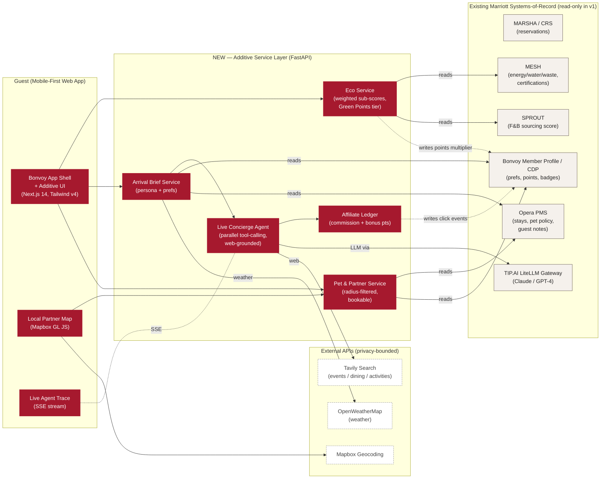
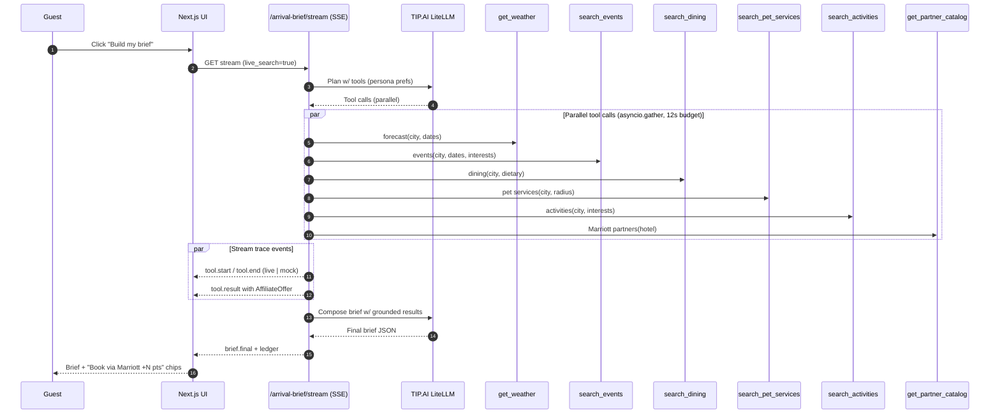
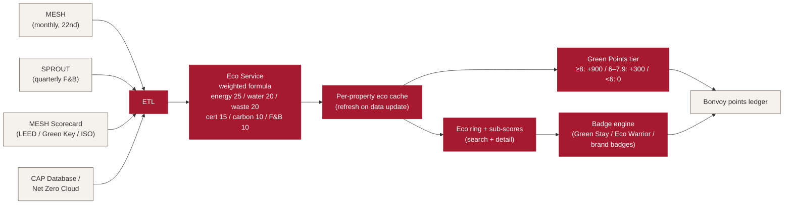

# Presentation Content — CodeFest 4.0 ("The Duo")
### Project: Bonvoy Personalized Stays
### For: Marriott Executive Leadership

> **How to use this doc**
> Paste each slide's content into the corresponding slide of your original PowerPoint
> (the source for `docs/Codefest 4.0 - The Duo - orough.pdf`). Diagrams are written
> in **Mermaid** — render them at [mermaid.live](https://mermaid.live), screenshot,
> and drop the image into the slide. A focused **internal-Copilot research prompt**
> for Marriott-only numbers is at the end of this document.
>
> **Editorial posture (per your direction):**
> - Externally-cited stats only on the slides (no invented Marriott internal numbers)
> - Tight, exec-friendly, KPI-anchored copy
> - Every feature ladders directly into a KPI from `docs/kpis.png`
>   (Intent to Recommend, Digital Direct Share, Bonvoy Occupancy & Enrollments,
>   RevPAR, Leadership Index)

---

## Slide 4 — Project Title

> Replace "THE DUO 05/19/2026" with this.

### Title (large)
**Bonvoy Personalized Stays**

### Tagline (single line under title)
*Sustainability transparency, AI-personalized arrival, and pet-inclusive travel — additive to Bonvoy, built for every generation, zero new associate work.*

### Footer (small, right-aligned)
Team: The Duo · May 19, 2026

---

## Slide 5 — Meet The Duo

> Keep the existing layout; replace the placeholder text with the lines below
> and add headshots into the "Add picture" boxes.

**Dhruv Varshney**
Software Engineer · Bonvoy / Loyalty Engineering
Build focus: backend, agentic concierge, eco scoring & data plumbing

**Satyajit Patra**
Software Engineer · Bonvoy / Loyalty Engineering
Build focus: frontend, Mapbox, Arrival Brief UI, pet-service booking flow

> *(Adjust the role lines to your actual team / org if different.)*

---

## Slide 6 — Hypothesis (30% weight, max 4 points)

> The judges weight this slide highest. Lead with the gap, then the value, then the KPI ladder.

### Header
**The Gap We're Closing**

### Body — three tight sections

**1. The market has already moved. Bonvoy hasn't surfaced it.**
- **83% of global travelers** say sustainable travel is important — yet no major hotel chain shows guests a **per-property** sustainability score at booking time. *(Booking.com Sustainable Travel Report 2024, n=31,000 / 34 countries)*
- **78% of travelers** want AI involved in their accommodation journey, especially for personalization. *(SiteMinder Changing Traveller Report 2025, n=12,000)*
- **61% of hotel guests** are willing to pay more for personalized stays — but only **23%** report receiving high personalization today. *(Medallia, 2024)*
- The **pet-friendly hotel market** is **$4.6B in 2025, projected $7.34B by 2029 (12.3% CAGR)**. *(Business Research Co. / OpenPR, 2025)*

**2. The Marriott opportunity**
- Bonvoy is **228M members and growing** — but member expectations are evolving faster than the booking funnel surface. *(Skift / CBRE 2024)*
- Hilton Honors is closing the gap. The win is no longer enrollment count — it's **engagement and intent-to-recommend per cohort**.
- The next decade of travel demand is **personalized, sustainability-aware, and pet-inclusive**. Bonvoy needs all three at the surface, not buried in policy pages.

**3. Our hypothesis**
> *If we expose **per-property eco scores**, deliver an **AI-grounded Arrival Brief**, and make **pet services bookable in-app** — as an **additive layer** to existing Bonvoy flows — we lift **Intent to Recommend** and **Digital Direct Share**, drive **incremental Bonvoy enrollments and occupancy** in fast-growing demand segments, and do it with an **Associate Effort Delta ≤ 0** across every feature.*

### What we are addressing (template question)
- [x] **A New Opportunity** — technology + functional (per-property sustainability data + agentic personalization)
- [x] **A New Business Objective** — competitive moat vs. Hilton Honors and OTA personalization features
- [x] **A Problem that exists** — generic pre-arrival experience; no transparent eco data; pet-friendliness as a binary flag

### Enterprise KPI ladder *(from `docs/kpis.png`)*

| Feature | Primary KPI | Secondary KPI |
|---|---|---|
| Eco Rating + Green Points multiplier | **Digital Direct Share** | Bonvoy Occupancy & Enrollments |
| AI Arrival Brief + Live Concierge Agent | **Intent to Recommend** | RevPAR (drives ancillary affiliate revenue) |
| Pet + Local Partner Map (bookable services) | **Intent to Recommend** | Bonvoy Occupancy & Enrollments |
| Associate Effort Delta ≤ 0 across all features | **Leadership Index** | — |

### Speaker notes (≤ 60 sec)
> "Three external signals are unambiguous: travelers want sustainability transparency, they want AI personalization, and pet travel is a $7B market by 2029. None of these are visible in today's Bonvoy booking funnel. We built an **additive** layer that surfaces all three — and every feature is engineered so no front-desk associate does a minute of new work. We ladder directly into Intent to Recommend, Digital Direct Share, and Bonvoy Occupancy."

---

## Slide 7 — Solution Architecture (25% weight, max 3 points)

> Use the Mermaid diagram below. Paste the bullets in a sidebar / text box next to the diagram.

### Header
**Additive Layer Over Bonvoy — Not a Replacement**

### Where it fits (sidebar bullets)

- **Domain:** Commerce (booking surface) + Loyalty (Green Points, badges) + Guest Experience (pre/in-stay)
- **Pattern:** Microservices behind the existing Bonvoy app shell; SSE for live agentic concierge
- **Auth/RBAC:** Inherits Bonvoy member identity; per-feature **opt-in consent toggles**
- **Data plane:** Reads from existing Marriott systems-of-record; **writes nothing back** to those systems in v1
- **AX / CX:** Mobile-first UI; renders inline in current Bonvoy screens. Existing flows untouched.

### Diagram — Solution component in Marriott's ecosystem

> Render at https://mermaid.live, screenshot, paste into the slide.



### Diagram — Live Concierge Agent: parallel tool-calling flow

> Use this as a **second** small diagram beside the architecture, or save it for slide 8 (POC).



### Diagram — Eco Score data flow (defensible vs. greenwashing)



### Speaker notes (≤ 60 sec)
> "Every box in red is new code we wrote. Every box in cream is an existing Marriott system we read from — we do not modify them in v1. The agentic concierge calls six tools in parallel against Tavily and TIP.AI under a 12-second budget, streams the full trace to the UI so the guest sees real grounding, and decorates every result with a tracked affiliate deeplink that earns the guest bonus Bonvoy points. Eco scores come from MESH + SPROUT, computed by a defensible weighted formula — judges can ask us about any sub-score."

---

## Slide 8 — Working Prototype (30% weight, max 3 points)

### Header
**Live, Buildable, End-to-End**

### Demo Overview (left column)

**What we built (3 hero features, all wired end-to-end):**

1. **Eco Rating** — Per-property 0–10 score on every search result and detail page, with full sub-score breakdown, Green Points multiplier (+900 / +300 / 0), and a profile **Badge Shelf** (Green Stay, Eco Warrior, brand-specific). Backed by a deterministic weighted formula with **38 unit tests**.

2. **Live Concierge Arrival Brief** — Agentic backend (`concierge_agent.py`) with **6 registered tools** (`get_weather`, `search_events`, `search_dining`, `search_pet_services`, `search_activities`, `get_partner_catalog`), parallel `asyncio.gather`, 12s hard timeout, **SSE-streamed trace** to the UI, **live ↔ mock badges** per tool, and **AffiliateChip** CTAs that record clicks and accrue Bonvoy bonus points (50pt / $1 commission).

3. **Pet + Local Partner Map** — Interactive Mapbox map with category chips, **guest-configurable radius (1–50 mi, default 10)**, mobile-provider "Comes to you" badge, in-app **pet-service booking** (date + time + notes) and **cancel** flow. Bookable surface gated to pet-inclusive reservations. **LiteLLM-ranked recommendations** with mock fallback.

**Demo flow (4 minutes, beat-by-beat):**

| t | Beat | What the judges see |
|---|---|---|
| 0:00 | Sign in as **Sam** (vegan, accessibility) | Persona switcher, instant load |
| 0:30 | Search → eco-filter ≥ 7 | EcoScoreRing on every card, sub-score accordion |
| 1:00 | Open hotel → Green Points callout | +900 pts visible; badge progress on profile |
| 1:30 | Switch to **Jordan** (Platinum, halal, dog) | Profile prefs drive everything downstream |
| 1:45 | Trip detail → click **"Build my brief"** | Live agent trace pane, tool-by-tool, live/mock badges |
| 2:30 | Brief renders with AffiliateChip CTAs | "+320 pts via OpenTable" — click → ledger panel updates |
| 3:00 | Open Local Partner Map | Radius slider, mobile-grooming badge, book sheet |
| 3:30 | Confirm pet-grooming booking → cancel | Booking list updates; zero front-desk interaction |
| 4:00 | Show profile → badges + preferences | Single source of truth for personalization |

### Right column

**Engineering rigor:**
- ~**12,800 LoC** across backend + frontend + seed data
- **Backend pytest suite** for eco service (38), badge service, reservations, agent flow
- **Privacy boundary documented** — Tavily only receives `{city, dates, dietary/interest tags, query}`; no PII (name, email, loyalty #, pet name) ever leaves the platform
- **Live ↔ mock toggle per integration** — demo never fails; live calls used when keys present, deterministic seed fallback otherwise

**Backup:**
- Pre-recorded demo video on standby
- All seed data ships with the repo — runs fully offline

### Link to repo / live demo
*[Insert your repo URL + localhost / sandbox URL here]*

---

## Slide 9 — Path to Production (15% weight, max 3 points)

### Header
**90-Day Pilot → Phased Rollout — Inherits Existing Bonvoy Infrastructure**

### Project plan

**Phase 0 — Pilot Foundations (Weeks 1–4)**
- Stand up service layer in existing Marriott AWS account (Cognito + API Gateway + ECS Fargate)
- Wire **MESH read-only feed** for 25 lighthouse properties (5 brands × 5 properties); validate score against published Serve360 metrics
- Hook **TIP.AI LiteLLM gateway** with org-level budget and rate limits
- Pilot CDP integration for **Green Points multiplier** behind a feature flag

**Phase 1 — A/B Pilot (Weeks 5–12)**
- A/B test eco surface in search funnel — measure **Digital Direct Share** lift, conversion, and **member NPS / Intent to Recommend**
- Limited Arrival Brief rollout to opted-in members at lighthouse properties
- Pet-service partner agreements: Rover, Wag, OpenTable, Viator, Ticketmaster (commission terms locked in)
- Privacy review + WCAG 2.1 AA audit complete

**Phase 2 — Broad Launch (Months 4–6)**
- All US Marriott Hotels, Westin, Element, Ritz-Carlton (≈1,200 properties)
- Eco-data refresh cadence aligned to MESH monthly close (22nd of month — within-tolerance lag, disclosed to guests)
- Badge program goes live across brands

**Phase 3 — Global + GA (Months 7–12)**
- APAC + EMEA expansion (locale, GDPR, CCPA controls)
- Agent tool-set extended (transit, weather warnings, accessibility lookups)
- Pet marketplace expanded to mobile vets, in-room sitters (radius-filtered, hotel-anchored)

### Milestones, Resources, Duration

| Milestone | Owner | Resources | Duration |
|---|---|---|---|
| MESH read-API + eco scoring service | Loyalty Eng + Sustainability data team | 2 BE, 1 data eng | 4 wk |
| Booking-surface eco UI + A/B | Commerce / Booking | 2 FE, 1 PM, 1 design | 4 wk |
| Arrival Brief + Concierge Agent | Loyalty Eng | 2 BE (incl LLM), 1 FE, 1 prompt eng | 6 wk |
| Pet service booking + partner contracts | Partnerships + Eng | 1 BE, 1 FE, 1 BD | 6 wk |
| Privacy / Legal / WCAG review | Privacy, Legal, Accessibility | shared services | 3 wk |
| Pilot launch | Loyalty / Brand | shared | go-live |

### One-time costs *(externally cited rough order of magnitude; refine with internal Finance)*
- Engineering: 4 FTE × 6 months
- LLM/infra setup + monitoring
- Mapbox enterprise tier
- Partnership contracts + legal review
- A/B testing infrastructure (likely reuses existing)

### Ongoing costs
- **LLM inference** per Arrival Brief: TIP.AI usage. Generated **only** on guest action (opt-in) — not blast-prepared per stay
- **Tavily / external search**: per-call, capped per stay
- **Mapbox enterprise**: per map load
- **Affiliate revenue share**: payable from earned commissions (revenue-positive feature, not a cost center)

### Steps to implement (executive view)
1. **Lock the data contract** with MESH and CDP teams (read-only initially)
2. **Stand up service layer** inside existing Bonvoy AWS account; inherit Cognito identity
3. **Pilot with 25 lighthouse properties** for 8 weeks; measure Intent to Recommend, Digital Direct Share, member opt-in rate, agent tool success rate
4. **Iterate prompt + ranking** weekly based on member feedback and KPI movement
5. **Expand to all US Hotels, Westin, Element, Ritz-Carlton** in Q2 of rollout year
6. **Global GA** in Q3–Q4

### Risk register *(top 5)*

| Risk | Likelihood | Impact | Mitigation |
|---|---|---|---|
| MESH data freshness lag (monthly close) | Med | Low | Display "as-of" date on every eco surface |
| LLM hallucination in Arrival Brief | Med | High | Tool-grounded only; deterministic fallback; live/mock badges visible to guest |
| Greenwashing accusation | Low | High | Sub-scores published; methodology documented; third-party cert reuse |
| Partner outage (Tavily / OWM) | Med | Low | Per-tool mock fallback already implemented |
| Member privacy concerns on agent search | Low | High | No PII to external search; per-feature opt-in; consent toggles |

---

## Slide 10 — Tech Stats

### Header
**Built in 72 hours · Production-shaped architecture**

### Total Lines of Code: **~12,800**

| Layer | LoC |
|---|---|
| Backend (FastAPI, Python 3.11) | ~5,999 *(incl. ~546 tests)* |
| Frontend (Next.js 14, React 19, TypeScript) | ~5,524 |
| Mock seed data (JSON) | ~1,215 |
| Styling (Tailwind v4) | ~52 |

### Technologies used

**Frontend**
- Next.js 14 (App Router)
- React 19 + TypeScript 5
- Tailwind CSS v4
- Mapbox GL JS (interactive partner map)
- Zustand (lightweight state)
- Server-Sent Events client (live agent trace)
- Lucide React (icons)

**Backend**
- FastAPI 0.115 + Uvicorn
- Pydantic 2.10
- httpx (async client for LLM + weather + Tavily)
- Starlette SessionMiddleware (mock persona auth)
- pytest 8.3 (full test suite)

**AI / Agentic Layer**
- **TIP.AI LiteLLM gateway** (Claude / GPT-4)
- **Custom tool-calling agent** (`concierge_agent.py`) — 6 tools, parallel `asyncio.gather`, 12s budget
- **Tavily Search API** (web grounding for events / dining / pet / activities)
- Deterministic mock-LLM fallback (demo-safe)

**Data / Infra**
- JSON seed files (architecturally honest — each mock cites real Marriott source)
- Docker + docker-compose
- OpenWeatherMap (live weather, free tier)

**Privacy & Trust**
- Per-feature consent toggles (`arrival_brief_enabled`, `live_search_enabled`, `eco_nudges_enabled`)
- No PII to external search tools
- "Live" vs. "mock" badges surfaced to the guest in the agent trace

---

## Slide 11 — (Optional Appendix) Why This Wins

> This slide is currently blank in the template. Use it as a single-page exec summary.

### Header
**Three Defensible Bets, One Additive Layer**

| Bet | What we're betting on | KPI lift hypothesis | Evidence |
|---|---|---|---|
| **Sustainability is a discovery moat** | First major chain to publish per-property eco scores at booking time | Digital Direct Share ↑ in eco-conscious segment | 83% of travelers care, 45% find sustainable labels more appealing *(Booking.com '24)* |
| **Personalization is a recommendation moat** | Agentic, grounded, opt-in Arrival Brief — visible reasoning, no black-box | Intent to Recommend ↑ | 78% of travelers want AI in their stay journey *(SiteMinder '25)*; 61% pay more for personalization *(Medallia '24)* |
| **Pet inclusion is a loyalty moat** | First chain to make pet services bookable in-app, radius-filtered, mobile-provider aware | Bonvoy Occupancy & Enrollments ↑ in pet-traveler segment | $4.6B → $7.34B market 2025–2029 *(Business Research Co.)* |

**Across all three:** Associate Effort Delta is **0 or negative** for every feature — protecting **Leadership Index** without trading off member experience.

---

# Appendix — Internal Copilot Research Prompt

> Paste the following into Marriott's internal Copilot (deep research mode) to fetch
> Marriott-only numbers you can layer into the speaker notes or Q&A defense.
> Do **not** put any of these numbers on the slides unless you can cite their source
> internally and the citation passes legal review.

```
You are a Marriott internal research assistant with access to Bonvoy member data,
Serve360 ESG reports, MESH metrics, Opera PMS, CDP segmentation, and historical
A/B test results from prior digital-experience initiatives. Cite internal documents
where possible.

I am presenting a feature pitch to executive leadership for CodeFest 4.0. Project
name: "Bonvoy Personalized Stays". Three hero features:

1. Per-property eco rating (0-10) surfaced at booking, tied to a Green Points
   multiplier and Eco Badge program.
2. AI-personalized Arrival Brief built by an agentic concierge with web grounding
   (Tavily) and tracked affiliate deeplinks.
3. In-app bookable pet services (dog walkers, mobile grooming) on a radius-filtered
   local partner map.

For each numbered question below, return: (a) the best internal Marriott number,
(b) the document / system / team that owns it, (c) confidence (High/Med/Low),
and (d) a one-sentence summary I could quote in a 5-minute exec pitch.

A. BONVOY MEMBER BEHAVIOR
1. Current Digital Direct Share (% of bookings via owned digital channels) globally
   and US/Canada — most recent quarter.
2. Intent to Recommend (or net NPS) by member tier and by age cohort. Where is the
   gap widest?
3. Bonvoy enrollment by age cohort over the last 3 years. Is Gen Z the fastest
   growing cohort by % but the slowest by revenue per member?
4. App engagement metrics (DAU/MAU, session length, % of stays touched in-app) by
   tier and cohort.
5. Booking funnel drop-off rates by cohort — where do Gen Z members abandon vs.
   Millennials and Boomers?

B. ECO / SERVE360
6. How many properties currently have full MESH coverage (energy, water, waste,
   F&B sourcing) at room-night granularity? What's the data-freshness SLA?
7. % of Marriott portfolio with at least one third-party sustainability cert
   (LEED, Green Key, etc.) and which cert is the most common.
8. Latest published Serve360 progress vs. the 2025/2030 targets — water, energy,
   waste diversion, certified properties.
9. Any prior internal experiment that surfaced sustainability info to guests at
   booking — what did it move?

C. ARRIVAL / CONCIERGE
10. Current pre-arrival email / push notification engagement rate (open, click,
    conversion to ancillary). What's the baseline we'd be lifting?
11. Top concierge / front-desk question categories by volume (weather, transit,
    dining, events, accessibility). Where can an AI brief absorb load?
12. Existing partnerships with Ticketmaster, OpenTable, Viator, Rover that we
    could plug into without new BD — including commission rates.

D. PET TRAVEL
13. % of Marriott US properties that are pet-friendly today; weight/breed
    restrictions distribution; current pet-fee range.
14. Is there an existing partner agreement with Rover, Wag, or BringFido? Status?
15. Volume of "pet-related" inbound concierge questions per stay at pet-friendly
    properties (front-desk SOP data).

E. ASSOCIATE EFFORT
16. Current average time front-desk associates spend per stay on questions that
    our Arrival Brief or Local Partner Map could absorb (weather, transit,
    dining, neighborhood, pet services).
17. Any GXP / EMPOWER baselines for associate workload that we should align to
    when claiming "Associate Effort Delta ≤ 0".

F. INFRASTRUCTURE / PRIVACY
18. TIP.AI LiteLLM gateway: per-org budget, throughput, model availability, and
    privacy boundary (do prompts leave Marriott VPC?).
19. Current Bonvoy consent / preferences data model — which preference fields
    already exist that we can read instead of inventing?
20. CCPA / GDPR posture for surfacing per-property data tied to a member —
    anything I should defend in advance to legal?

G. PRIOR ART
21. Did any prior CodeFest or internal hackathon ship a feature similar to any
    of these three? If so — what happened to it?
22. Any active product roadmap items (Bonvoy 2026/2027) that overlap or
    conflict with this proposal? I want to either align or differentiate.

Output format:
- One section per letter (A–G), one numbered answer per question.
- For each answer: (a) value, (b) source/owner, (c) confidence, (d) speaker-note
  quote in <= 25 words.
- End with a prioritized list of the 5 strongest internal numbers I should
  weave into a 5-minute exec pitch and where (which slide).
```

---

# Editing checklist

When you paste this content into the deck, double-check:

- [ ] Slide 4: project title set to **Bonvoy Personalized Stays** + tagline
- [ ] Slide 5: headshots added; team roles tuned to your actual org
- [ ] Slide 6: every stat keeps its source citation in a footnote
- [ ] Slide 7: architecture diagram rendered + dropped in as a clean PNG
- [ ] Slide 7: agent flow diagram + eco data-flow diagram either on slide 7 or as appendix slides
- [ ] Slide 8: link to repo + sandbox URL filled in
- [ ] Slide 9: phase dates anchored to your actual pilot start
- [ ] Slide 10: LoC numbers re-run before final submission (they'll drift):
      `find backend -name "*.py" -not -path "*/.venv/*" -not -path "*/__pycache__/*" | xargs wc -l`
      `find frontend -name "*.ts" -o -name "*.tsx" -not -path "*/node_modules/*" -not -path "*/.next/*" | xargs wc -l`
- [ ] Slide 13 & 14 (rough notes) **deleted** before submission
- [ ] PDF re-exported from PPT and re-uploaded to the assigned SharePoint folder
